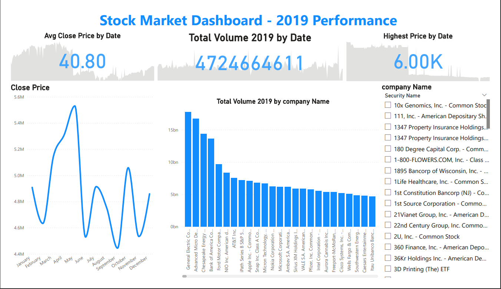

# Power BI Dashboard – 2019 Stock Market Performance

Interactive Power BI dashboard analyzing company performance in 2019.  
Highlights key metrics, visualizes trends, and enables company-level comparisons.

## Screenshots

## Dataset
The dataset used for this project can be downloaded here:  
[Stock Market 2019 Dataset](https://www.kaggle.com/datasets/jacksoncrow/stock-market-dataset))

## Features
- Key metrics displayed using **Cards**: Total Volume, Avg Close Price, Highest Price.  
- **Line Chart** for visualizing stock closing trends throughout 2019.  
- **Bar Chart** for comparing total trading volume across companies.  
- Interactive **Slicer** to filter by company and focus on individual performance.
